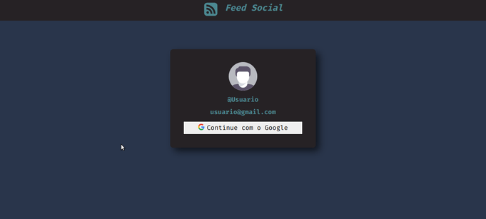

<h1 align="center">Feed Social</h1>

<p align="left">Aplicação tem o intuito de ser semelhante a uma rede social como facebook, por meio do feed, é possivel fazer publicações, comentarios e postagens de fotos, usando como meio de autentificação uma conta google.</p>

##

<br>


<h1 align="left">
  
  
  

</h1>

## Tecnologias :hammer_and_pick:

As seguintes ferramentas foram usadas na construção do projeto:

- [x] [Next JS](https://nextjs.org/)
- [x] [TypeScript](https://www.typescriptlang.org/)
- [x] [FIREBASE](https://firebase.google.com/)
- [x] [React JS](https://pt-br.reactjs.org/)
- [x] [Context API](https://pt-br.reactjs.org/docs/context.html)
- [x] [Zod](https://github.com/colinhacks/zod)
- [x] [Css-modules](https://github.com/css-modules/css-modules)
- [x] [UUID](https://www.npmjs.com/package/uuid) 
- [x] [REACT-HOOK-FORM](https://react-hook-form.com/)
- [x] [PHOSPHOR-REACT](https://phosphoricons.com/)
- [x] [NEXT-AUTH](https://next-auth.js.org/)
- [x] [IMMER](https://github.com/immerjs/immer)
- [x] [DATE-FNS](https://date-fns.org/)


## Pré-requisitos

Antes de começar, você vai precisar ter instalado em sua máquina as seguintes ferramentas:
[GIT](https://git-scm.com/), [Node.js](https://nodejs.org/en/).

Além disto é bom ter um editor para trabalhar com o código como [VSCode](https://code.visualstudio.com/)


## Rodando o App

```bash
# Clone este repositório
$ git clone https://github.com/CleberWacheski/Social-Feed-NextJs
# Acesse a pasta do projeto no terminal/cmd
$ cd Social-Feed-NextJs
# Instale as dependências
$ npm install 
# Inicie o expo
$ npm run dev
```


